# [TENSORFLOW] Character-level Convolutional Networks for Text Classification

## Introduction

Here is my tensorflow implementation of the model described in the paper **Character-level Convolutional Networks for Text Classification** [paper](https://arxiv.org/abs/1509.01626). 

## Datasets:

Statistics of datasets I used for experiments. These datasets could be download from [link](https://drive.google.com/drive/u/0/folders/0Bz8a_Dbh9Qhbfll6bVpmNUtUcFdjYmF2SEpmZUZUcVNiMUw1TWN6RDV3a0JHT3kxLVhVR2M)

| Dataset                | Classes | Train samples | Test samples |
|------------------------|:---------:|:---------------:|:--------------:|
| AG’s News              |    4    |    120 000    |     7 600    |
| Sogou News             |    5    |    450 000    |    60 000    |
| DBPedia                |    14   |    560 000    |    70 000    |
| Yelp Review Polarity   |    2    |    560 000    |    38 000    |
| Yelp Review Full       |    5    |    650 000    |    50 000    |
| Yahoo! Answers         |    10   |   1 400 000   |    60 000    |
| Amazon Review Full     |    5    |   3 000 000   |    650 000   |
| Amazon Review Polarity |    2    |   3 600 000   |    400 000   |

## Setting:

I almost keep default setting as described in the paper. For optimizer and learning rate, there are 2 settings I use:

- **SGD** optimizer with different initial learning rates (0.01 in most cases). The learning rate is halved every 3 epochs.
- **Adam** optimizer with different learning rates (0.001 in most case).

Additionally, in the original model, one epoch is seen as a loop over batch_size x num_batch records (128x5000 or 128x10000 or 128x30000), so it means that there are records used more than once for 1 epoch. In my model, 1 epoch is a complete loop over the whole dataset, where each record is used exactly once.

## Training
After putting 2 files **train.csv** and **test.csv** from any dataset mentioned above into **data** folder, there are several options for training:

If you want to train a model with common dataset and default parameters, you could run:
- **python train.py**

If you want to train a model with your preference parameters, like optimizer and learning rate, you could run:
- **python train.py --optimizer optimizer_name --lr learning_rate**: For example, python train.py --optimizer adam --lr 0.001

If you want to train a model with your own dataset, you need to specify the paths to input (train and test files) and output folder:
- **python train.py --train_set path/to/training/file --test_set path/to/test/file --saved_path path/to/output/folder**

You could find all trained models I have trained in [link](https://drive.google.com/open?id=1Aj01eRpGONphFy1SPCMiSfuCqP5G1d5L)

## Experiments:

I run experiments in 2 machines, one with NVIDIA TITAN X 12gb GPU and the other with NVIDIA quadro 6000 24gb GPU. For small and large models, you need about 1.6 gb GPU and 3.5 gb GPU respectively.

Results for test set are presented as follows:  A(B):
- **A** is accuracy reproduced here.
- **B** is accuracy reported in the paper.
I used SGD and Adam as optimizer, with different initial learning rate. You could find out specific configuration for each experiment in **trained_models/logs.txt**.

Maximally, each experiment would be run for 20 epochs. Early stopping was applied with patience is set to 3 as default.

|      Size     |     Small  |     Large    |
|:---------------:|:--------------:|:--------------:|
|    ag_news    | 86.74(84.35) | 88.00(87.18) |
|   sogu_news   | 94.46(91.35) | 94.66(95.12) |
|    db_pedia   | 97.71(98.02) | 97.29(98.27) |
| yelp_polarity | 92.17(93.47) | 92.67(94.11) |
|  yelp_review  | 58.97(59.16) | 59.61(60.38) |
|  yahoo_answer |      (70.16) |      (70.45) |
| amazon_review | 57.25(59.47) | 59.03(58.69) |
|amazon_polarity| 93.54(94.50) | 94.85(94.49) |

The training/test loss/accuracy curves for each dataset's experiments (figures for small model are on the left side) are shown below:

- **ag_news**

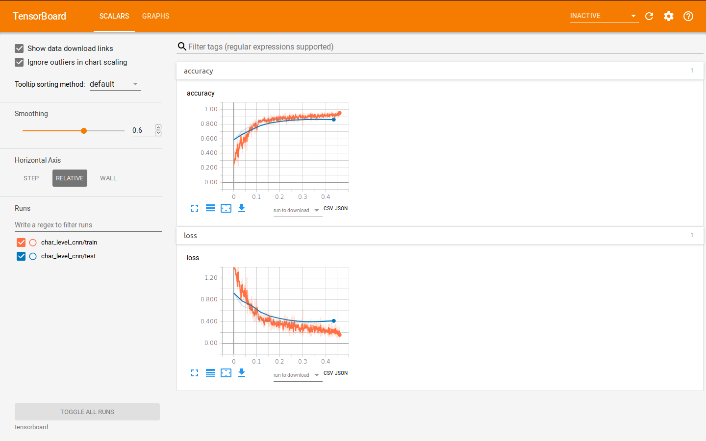 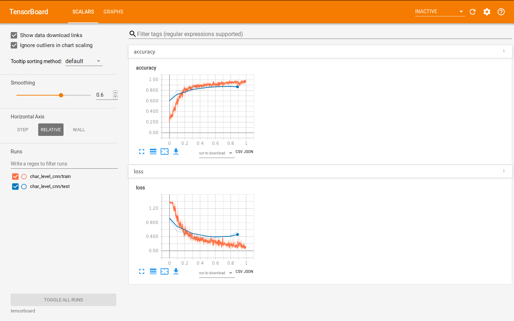 

- **sogou_news**

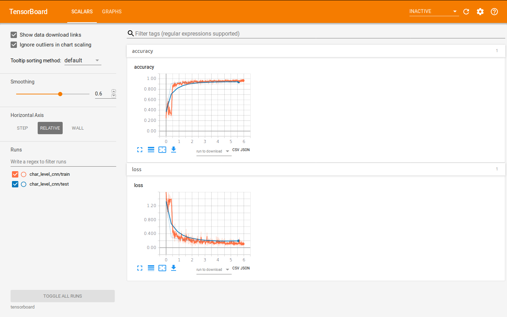 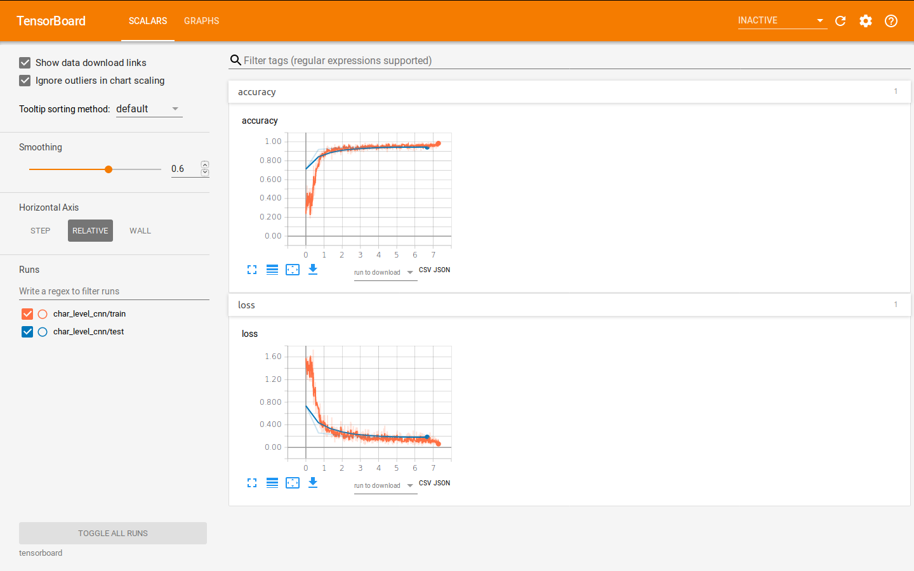 

- **db_pedia**

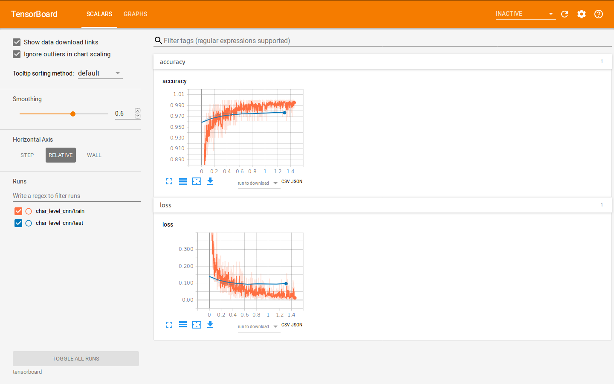 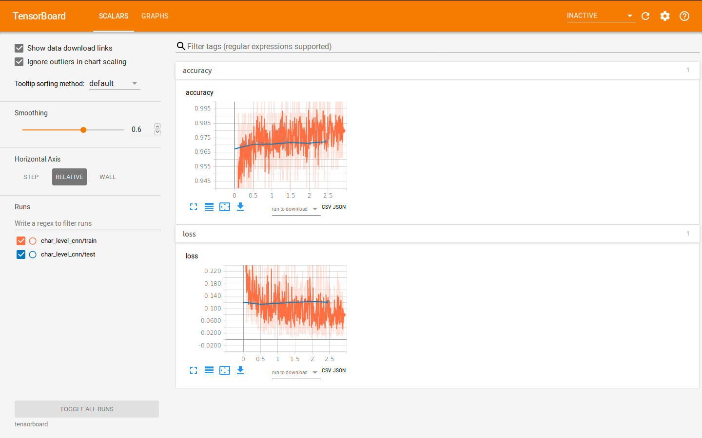

- **yelp_polarity**

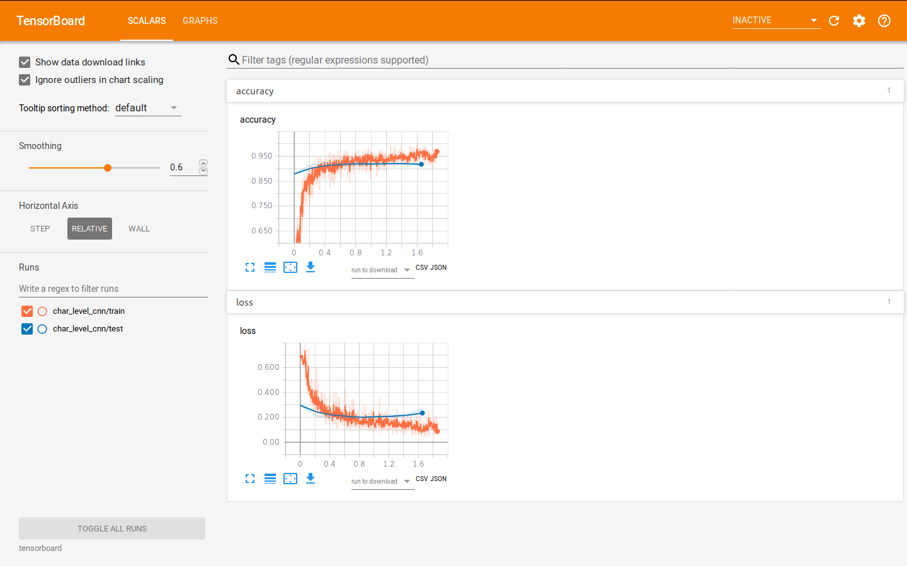 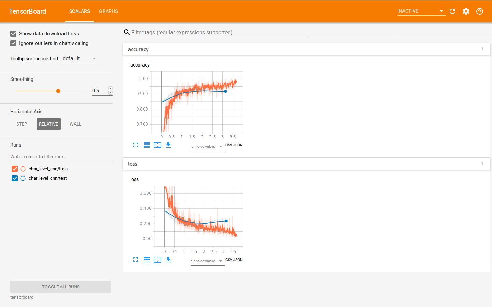

- **yelp_review**

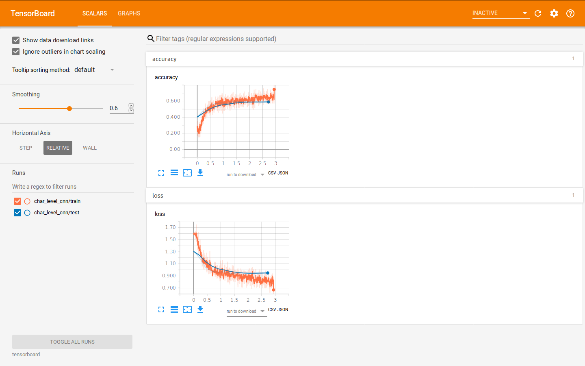 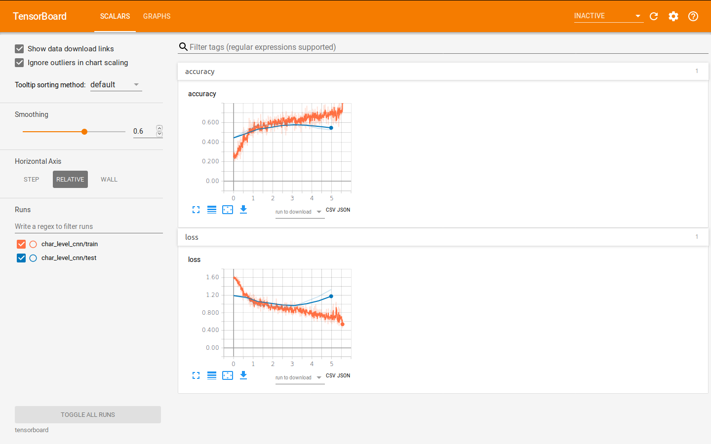

- **amazon_review**

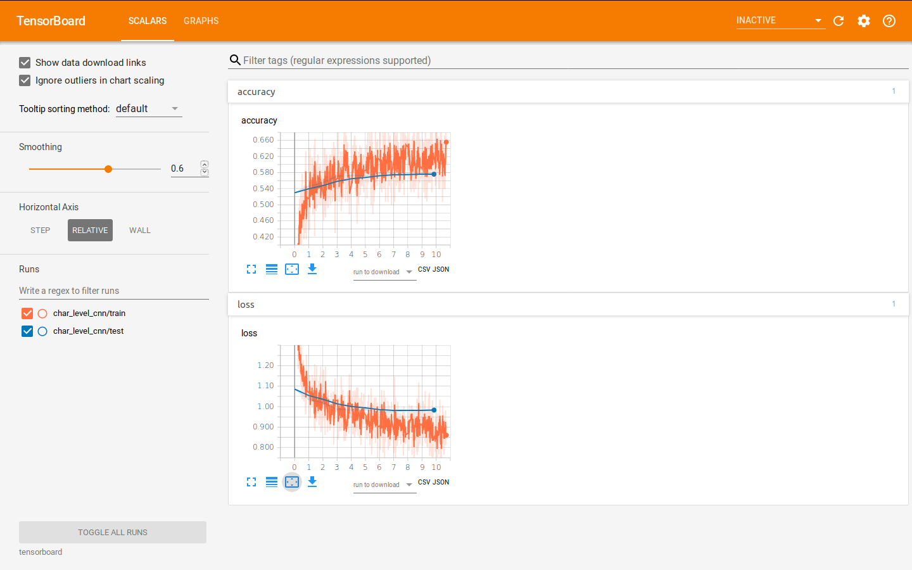 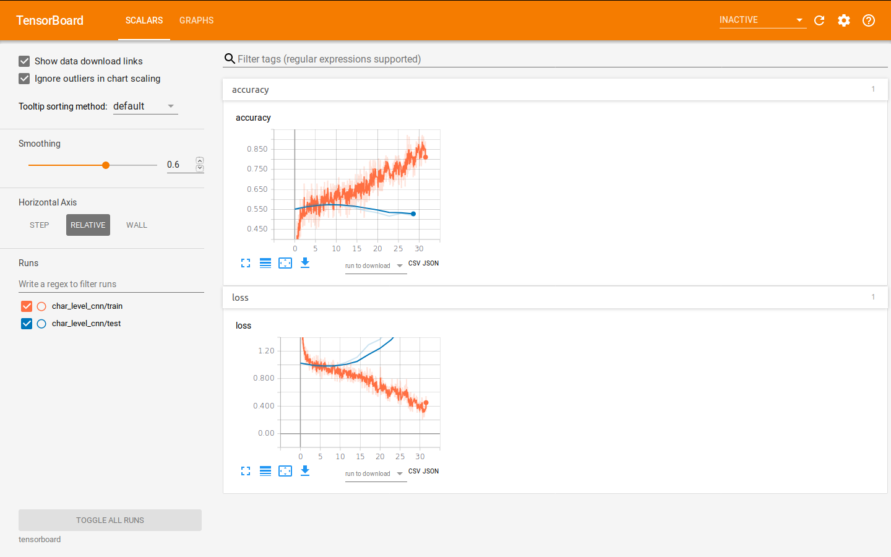

- **amazon_polarity**

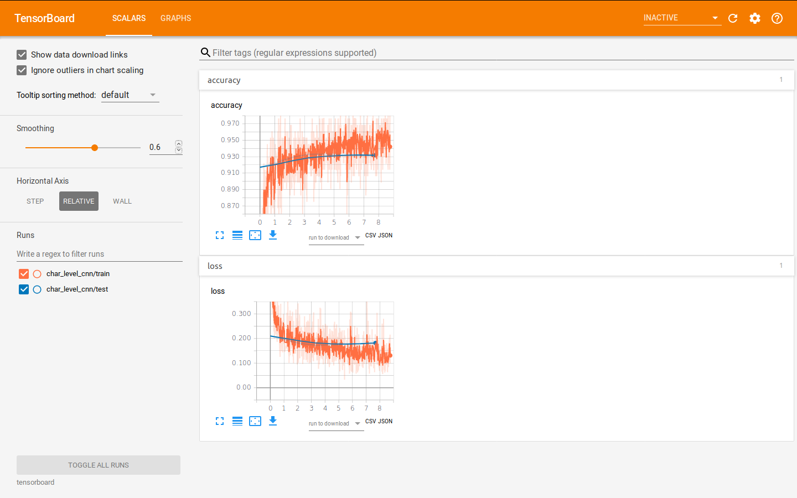 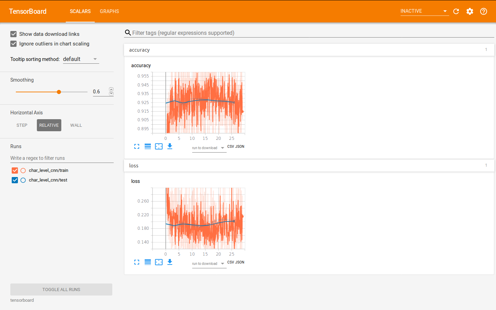

You could find detail log of each experiment containing loss, accuracy and confusion matrix at the end of each epoch in **trained_models/logs.txt**.
